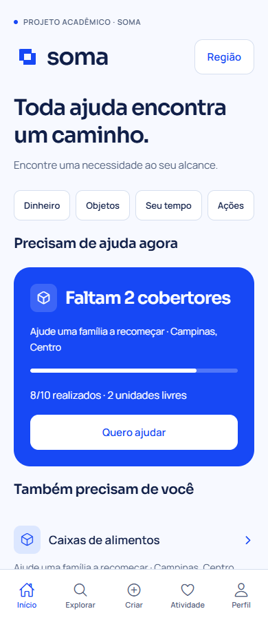
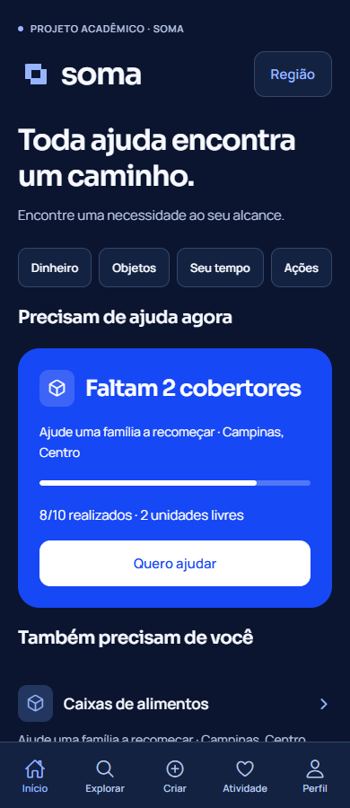
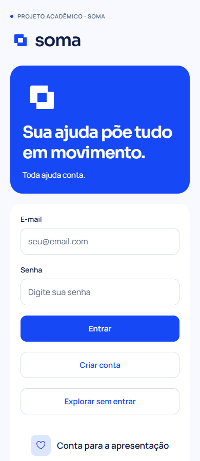

# SOMA — Enlace e azul royal

O usuário aprovou o conceito Enlace com azul royal após comparar três marcas e duas rodadas de paletas. O contexto é o SOMA solidário: campanhas, objetos, contribuições financeiras simuladas, tarefas e voluntariado. O aplicativo mantém 35 rotas, cinco abas, permissões, contratos da API e regras de negócio. `backend/` e `src/servicos/api.ts` permanecem sem alterações neste redesign.

## Identidade e aplicações

O símbolo reúne dois módulos complementares: necessidade e contribuição se encontram. A mesma geometria de 100 unidades aparece no componente nativo, nos vetores e nas imagens de ícone/splash. O sinal funciona sozinho no ícone; a assinatura usa “soma” em minúsculas.

| Papel | Tema claro | Tema escuro |
| --- | --- | --- |
| Azul principal / destaque | #1748F5 | #1748F5 |
| Ação sobre superfície | #1748F5 | #97B5FF |
| Texto principal | #101F48 | #F7F9FF |
| Fundo | #F7F9FF | #0B1530 |
| Superfície | #FFFFFF | #142242 |
| Texto secundário | #52617D | #B8C6E4 |
| Apoio / seleção suave | #DCE7FF | #22365F |
| Divisor | #D6DFEF | #344769 |

O azul intenso ocupa os destaques principais e o ícone. Branco sobre royal tem contraste 6,40:1; no tema escuro, as ações sobre superfícies usam azul claro com texto profundo. Erros têm mensagem, ícone e cor próprios. Contraste de paleta não equivale a certificação integral de acessibilidade.

Sora 600 nos títulos e assinatura; Manrope 400/600 em leitura e controles. Três TTF locais somam aproximadamente 236 kB e estão acompanhados das licenças SIL OFL. Fonte do sistema como alternativa em caso de falha. Não há serviço externo de fontes em execução nem biblioteca de runtime adicionada.

Vetores e imagens: `assets/brand/`. Os assets originais da base continuam em `assets/images/`. Configuração Expo atualizada para ícone, favicon, adaptive icon e splash. Para regenerar os PNGs/vetores, execute `python scripts/gerar-marca.py` com Pillow instalado; Python/Pillow são ferramentas de exportação, não dependências do aplicativo.

## Composição das telas

- Início: título editorial, uma necessidade em destaque azul e demais necessidades em listas compactas. O destaque vem dos dados da API. A quantidade faltante considera o recebido; disponibilidade desconta reservas, preservando a diferença entre reservado e realizado.
- Explorar: marca, busca, categorias, filtros e listas com divisores. Busca e filtro de região existentes preservados.
- Entrada: área de marca azul e formulário separado, com cadastro, visita e informação acadêmica existentes.
- Criação/contribuição: formulários agrupados em superfície de leitura, campos com foco visível, etapas textuais e quatro segmentos de progresso na criação.
- Campanha/necessidade: história, estado, meta, disponibilidade, instruções e ação com hierarquia distinta. Sem indicadores de impacto inventados.
- Gestão/atividade/administração: agrupamentos por assunto e listas para reduzir a repetição de cartões.
- Saldo: valor disponível em destaque, estados financeiros alinhados e rótulos de simulação mantidos.
- Todas as rotas: tipografia, botões, avisos, modais, navegação e temas compartilhados. Áreas seguras e comportamento de teclado considerados nos formulários.

## Movimento e acessibilidade

Preferência de movimento reduzido lida no sistema e acompanhada durante a sessão. O padrão inicial é estático até conhecer a preferência. Sem introdução ou deslocamento quando ela está ativa; diálogos sem animação.

Splash nativa estática com o símbolo real. Carrega apenas as fontes locais indispensáveis; erro ou limite de 3 s libera a interface com a fonte do sistema. Após a interface ficar pronta, a construção dos dois módulos dura 1,8 s e ocorre uma vez por inicialização. A camada não captura toques e desaparece ao navegar, sem aguardar API ou banco. Não repete ao trocar abas.

Conteúdo entra com deslocamento de 8 pontos em 220 ms. Pressão dos botões usa escala 0,98 em 120 ms; resposta depende da preferência do sistema. Navegação nativa respeita avançar/voltar, com transição desativada em movimento reduzido. Progresso e estados incluem informação textual; controles têm rótulos acessíveis e alvos de pelo menos 44 pontos. Reutiliza Animated, Expo Font, Splash Screen e Ionicons já instalados.

## Pesquisa que orientou a direção

[Pinterest — Charity Mobile App](https://in.pinterest.com/pin/charity-mobile-app--311029918012915666/) e [Donation App](https://ph.pinterest.com/pin/611926668151157131/) iniciaram a curadoria do setor. Os pins foram encontrados por indexação; o acesso integral foi limitado. [Airatae no Behance](https://www.behance.net/gallery/164519905/Corporate-Brand-Identity-Website-for-a-Non-Profit?locale=en_US) e [caso da agência](https://dd.nyc/work/airatae-non-profit-tech-platform/) orientaram a coerência entre identidade e comunidade. [Charity App no Dribbble](https://dribbble.com/shots/22103257-Charity-App-UI-Ux) e [Donation Charity App](https://dribbble.com/shots/14962021-Donation-Charity-App-full) ajudaram a comparar causa, ação e hierarquia móvel.

[Mobbin](https://mobbin.com/) foi referência complementar da galeria pública; fluxos protegidos por conta não foram auditados. O [índice histórico do Awwwards](https://www.awwwards.com/blog/?page=10&tag=inspiration&text=identity-design) foi consultado como levantamento, sem atribuir a ele tendências atuais. Os símbolos são desenhos independentes desta proposta, sem copiar marcas dessas referências.

APIs conferidas para o SDK 54: [Expo Font](https://docs.expo.dev/versions/v54.0.0/sdk/font/) e [Splash Screen](https://docs.expo.dev/versions/v54.0.0/sdk/splash-screen/).

## Validação

TypeScript, lint e exportação web passaram. Bundles Hermes de Android (1.087 módulos) e iOS (1.091 módulos) foram exportados; isso verifica a compilação JavaScript, não representa APK/IPA nem teste em aparelho. A splash e as áreas seguras nativas ainda precisam de revisão em build de dispositivo.

A primeira tentativa de regressão real encontrou `ECONNREFUSED 127.0.0.1:3306` porque o Docker Desktop não iniciava. A validação foi concluída depois com MySQL 8.4.8 próprio do projeto na porta 3307: os **8 testes de backend passaram**, incluindo persistência após reiniciar a API. Cadastro, criação em quatro etapas, atualização, perfil e logout também passaram pelas telas com a API real. A persistência foi conferida novamente após parar e iniciar o próprio MySQL. Veja [VALIDACAO-MYSQL.md](VALIDACAO-MYSQL.md) e [WINDOWS.md](WINDOWS.md).

A validação no Edge utilizou respostas controladas da API para verificar a interface independentemente dessa falha de infraestrutura. Ela não substitui o teste Node/MySQL nem comprova persistência real. Resultado: 35 rotas como visitante e administrador (70 verificações), mais 56 combinações de telas representativas/tema/largura, totalizando 126 verificações de layout. Temas claro e escuro em 320, 390, 768 e 1.280 pixels sem transbordamento horizontal; nenhum erro JavaScript de página.

Login/navegação, busca e filtro de região, reserva/cancelamento, pagamento/status, quatro etapas de criação, dados enviados à API, perfil/logout e introdução com/sem movimento reduzido passaram com as respostas controladas. A camada de introdução foi verificada sem captura de eventos e termina automaticamente. Resultados detalhados: [VALIDACAO-REDESIGN.json](VALIDACAO-REDESIGN.json).

Uma checagem adicional do build final confirmou que reservas não reduzem a quantidade ainda faltante na meta, mas reduzem as unidades livres para contribuir. Os estados sem pedidos e com erro de conexão também foram conferidos em 320 pixels, sem destaque inventado, transbordamento ou erro JavaScript.

Capturas de exemplo com dados controlados, na largura de 390 pixels:

